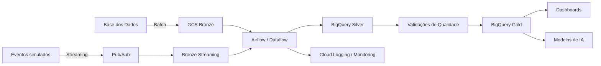

# TechChallenge-Fase2
Projeto da Pós Tech FIAP TechChallenge  Fase 2

# Pipeline Híbrido para Análise da Alfabetização no Brasil

## 1. Contexto do problema
Explicar o Compromisso Nacional Criança Alfabetizada, o indicador de alfabetização e o ponto de corte de 743 pontos na escala Saeb.

## 2. Objetivo
Construir uma pipeline híbrida Batch + Streaming para integrar dados educacionais, aplicar qualidade, gerar camada analítica e apoiar análises de políticas públicas.

## 3. Fontes de dados
- UF
- Município
- Metas Brasil
- Metas por UF
- Metas por Município
- Dados de alunos / indicadores
- Fonte principal: Base dos Dados
        
        https://basedosdados.org/dataset/073a39d4-89cf-4068-b1e8-34ed0d9c0b72?table=bb27c746-18df-4ba8-8f98-5110232e2162
        
        https://www.gov.br/inep/pt-br/areas-de-atuacao/avaliacao-e-exames-educacionais/avaliacao-da-alfabetizacao/resultados

## 4. Arquitetura da solução
Explicar GCP, GCS, BigQuery, Pub/Sub, Airflow e camadas Bronze/Silver/Gold.

## 5. Diagrama da pipeline

## 6. Fluxo de dados
Para popular a camada bronze, foi feita a conversao dos dados obtidos na origem em parquet, armazenando os mesmos em data\bronze

## 7. Camadas Medalhão
### Bronze
Dados brutos, convertidos em parquet, sem analise ou limpeza ou integração.
### Silver
Dados tratados e integrados.
### Gold
Dados analíticos.

## 8. Batch vs Streaming
Explicar por que dados históricos entram via Batch e atualizações simuladas entram via Streaming.

## 9. Qualidade de dados
Listar regras de validação.

## 10. Monitoramento
Explicar logs, alertas, métricas e falhas.

## 11. FinOps
Explicar Parquet, particionamento, BigQuery sob demanda, controle de recursos e otimização de queries.

## 12. Aplicação em IA
Explicar uso da Gold para predição de alfabetização, análise de desigualdade e apoio a políticas públicas.

## 13. Como executar
Passos para rodar localmente ou em cloud.

## 14. Organização Git
Branchs:
* bronze-layer: dados convertidos para parquet na camada bronze. 
* silver-layer:
* gold-layer:

## 15. Autores - Grupo 126
 - Alessandra M. Capecce,
 - Alessandro P. dos Santos,
 - Edson L. Doro

 

 