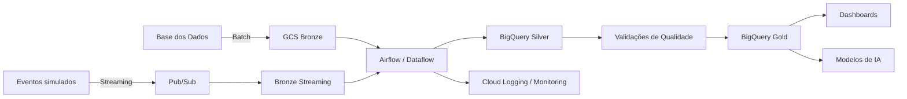

# TechChallenge-Fase2
Projeto da Pós Tech FIAP TechChallenge  Fase 2

# Pipeline Híbrido para Análise da Alfabetização no Brasil

## 1. Contexto do problema
Explicar o Compromisso Nacional Criança Alfabetizada, o indicador de alfabetização e o ponto de corte de 743 pontos na escala Saeb.

## 2. Objetivo
Construir uma pipeline híbrida Batch + Streaming para integrar dados educacionais, aplicar qualidade, gerar camada analítica e apoiar análises de políticas públicas.

## 3. Fontes de dados
- UF
- Município
- Metas Brasil
- Metas por UF
- Metas por Município
- Dados de alunos / indicadores
- Fonte principal: Base dos Dados
        
        https://basedosdados.org/dataset/073a39d4-89cf-4068-b1e8-34ed0d9c0b72?table=bb27c746-18df-4ba8-8f98-5110232e2162
        
        https://www.gov.br/inep/pt-br/areas-de-atuacao/avaliacao-e-exames-educacionais/avaliacao-da-alfabetizacao/resultados

## 4. Arquitetura da solução
"Explicar GCP, GCS, BigQuery, Pub/Sub, Airflow e camadas Bronze/Silver/Gold."

## 5. Diagrama da pipeline

## 6. Fluxo de dados
Para popular a camada bronze, foi feita a conversão dos dados obtidos na origem em parquet, armazenando os mesmos em 'data\bronze'

## 7. Camadas Medalhão
### Bronze
Dados brutos, convertidos em parquet, sem análise, limpeza ou integração.
### Silver
A camada Silver foi construída a partir dos arquivos Parquet da camada Bronze. 
Nesta etapa foram aplicadas regras de limpeza, padronização e validação para garantir maior confiabilidade dos dados.

Tratamentos aplicados:

- Padronização dos nomes das colunas para formato snake_case
- Remoção de espaços em branco em campos textuais
- Conversão de campos numéricos, como ano, metas e percentuais
- Padronização de `sigla_uf` em letras maiúsculas
- Padronização de `id_municipio` com 7 dígitos
- Remoção de duplicidades por chaves de negócio
- Validação de ano entre 2023 e 2030
- Validação de percentuais e metas entre 0 e 100
- Separação de registros inválidos em uma área de quarentena
- Integração das bases de metas e avaliações por município e UF

Arquivos gerados:

- `silver_meta_alfabetizacao_brasil.parquet`
- `silver_meta_alfabetizacao_uf.parquet`
- `silver_meta_alfabetizacao_municipio.parquet`
- `silver_avaliacao_alfabetizacao_uf.parquet`
- `silver_avaliacao_alfabetizacao_municipio.parquet`
- `silver_indicador_municipio.parquet`
- `silver_indicador_uf.parquet`

### Gold
Dados analíticos.

## 8. Batch vs Streaming
Todos os dados históricos obtidos através dos links disponiveis entram via batch no processo.

## 9. Qualidade de dados
As validações utlizadas foram:
- Dados duplicados
- Dados nulos

## 10. Monitoramento
"Explicar logs, alertas, métricas e falhas."

## 11. FinOps
O uso do Parquet é fundamental para garantir que o custo do processamento nao seja elevado dado ao volume de dados manipulado.

## 12. Aplicação em IA
Explicar uso da Gold para predição de alfabetização, análise de desigualdade e apoio a políticas públicas.

## 13. Como executar
Passos para rodar localmente ou em cloud.

## 14. Organização Git
Branchs:
* bronze-layer: dados convertidos para parquet na camada bronze. 
* silver-layer:dados tratados e normalizados para garantir a qualidade das analises
* gold-layer: dados analisados para que sejam capturados os insights propostos no projeto

O desenvolvimento foi organizado com branchs de funcionalidade, como 'bronze-layer', integradas a branch principal 'main' por meio de Pull Requests.

## 15. Autores - Grupo 126
 - Alessandra M. Capecce,
 - Alessandro P. dos Santos,
 - Edson L. Doro

 

 