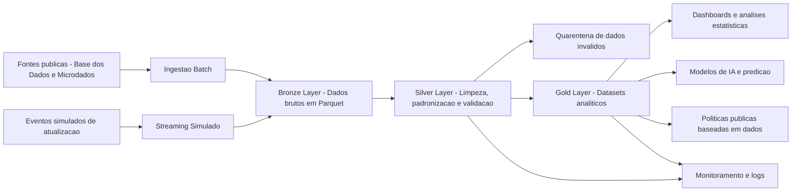

# Tech Challenge - Fase 2

## Pipeline Hibrido para Analise da Alfabetizacao no Brasil

Este projeto foi desenvolvido como parte do **Tech Challenge - Fase 2**, com o objetivo de construir uma pipeline hibrida de dados para analise da alfabetizacao no Brasil, utilizando dados publicos educacionais e seguindo boas praticas modernas de Engenharia de Dados.

A solucao implementa uma arquitetura baseada no padrao **Medalhao**, com as camadas **Bronze**, **Silver** e **Gold**, contemplando ingestao batch, simulacao de ingestao streaming, validacoes de qualidade, preparacao de dados analiticos e estrutura para uso futuro em aplicacoes de Inteligencia Artificial.

---

## 1. Contexto do problema

A alfabetizacao na infancia e um fator essencial para o desenvolvimento educacional, social e economico do Brasil. O **Compromisso Nacional Crianca Alfabetizada** tem como objetivo garantir que todas as criancas brasileiras estejam alfabetizadas ate o final do 2o ano do ensino fundamental.

A partir da **Pesquisa Alfabetiza Brasil**, realizada pelo INEP em 2023, foi definido o ponto de corte de **743 pontos na escala de proficiencia do Saeb**, a partir do qual uma crianca pode ser considerada alfabetizada.

Com base nesse parametro, foi criado o **Indicador Crianca Alfabetizada**, que expressa o percentual de estudantes que atingem esse nivel de proficiencia. A meta nacional e que, ate 2030, todas as criancas brasileiras estejam alfabetizadas ao final do 2o ano do ensino fundamental.

O desafio deste projeto e integrar diferentes fontes de dados educacionais, tratar inconsistencias, organizar os dados em uma arquitetura escalavel e disponibilizar uma camada analitica confiavel para apoiar politicas publicas baseadas em evidencias.

---

## 2. Objetivo do projeto

Construir uma pipeline de dados escalavel e organizada em camadas, capaz de:

- Ingerir diferentes bases educacionais publicas;
- Armazenar dados brutos na camada Bronze;
- Tratar, padronizar e validar dados na camada Silver;
- Construir datasets analiticos na camada Gold;
- Comparar resultados de alfabetizacao com metas municipais e estaduais;
- Simular ingestao de eventos em tempo quase real;
- Disponibilizar dados prontos para dashboards, analises estatisticas e aplicacoes de IA;
- Demonstrar praticas de qualidade, monitoramento, FinOps e governanca de dados.

---

## 3. Fontes de dados

As fontes utilizadas foram obtidas a partir da plataforma **Base dos Dados** e de microdados relacionados a avaliacao da alfabetizacao.

As principais entidades consideradas no projeto sao:

- UF;
- Municipio;
- Meta de alfabetizacao Brasil;
- Meta de alfabetizacao por UF;
- Meta de alfabetizacao por municipio;
- Avaliacao de alfabetizacao por UF;
- Avaliacao de alfabetizacao por municipio;
- Microdados AEEB de aluno, estado, item e municipio.

### Principais bases utilizadas

| Base | Descricao |
|---|---|
| `meta_alfabetizacao_brasil` | Metas nacionais de alfabetizacao |
| `meta_alfabetizacao_uf` | Metas estaduais de alfabetizacao |
| `meta_alfabetizacao_municipio` | Metas municipais de alfabetizacao |
| `avaliacao_alfabetizacao_uf` | Resultados da avaliacao por UF |
| `avaliacao_alfabetizacao_municipio` | Resultados da avaliacao por municipio |
| `microdados_AEEB` | Dados complementares da avaliacao de alfabetizacao |

---

## 4. Arquitetura da solucao

A solucao foi estruturada com base na **Arquitetura Medalhao**, separando os dados em tres camadas principais:

- **Bronze Layer**: dados brutos ingeridos das fontes;
- **Silver Layer**: dados tratados, padronizados e validados;
- **Gold Layer**: dados analiticos prontos para consumo.

A arquitetura foi desenhada para ser executada localmente durante o desenvolvimento, mas com possibilidade de evolucao para ambiente em nuvem, utilizando servicos como:

- **Google Cloud Storage ou Amazon S3** para armazenamento das camadas do Data Lake;
- **BigQuery, Athena ou Redshift** para consultas analiticas;
- **Pub/Sub, Kafka ou Kinesis** para ingestao streaming;
- **Airflow ou Cloud Composer** para orquestracao;
- **Cloud Logging, Cloud Monitoring ou CloudWatch** para observabilidade.

---

## 5. Diagrama da pipeline



---

## 6. Fluxo de dados

O fluxo da pipeline segue as seguintes etapas:

1. **Coleta dos dados brutos**
   - Arquivos publicos sao carregados a partir da pasta `data/raw`.

2. **Ingestao na Bronze**
   - Os arquivos sao lidos, recebem metadados tecnicos e sao salvos em formato Parquet.

3. **Tratamento na Silver**
   - Os dados sao padronizados, validados e integrados.
   - Registros invalidos ou duplicados sao separados em area de quarentena.

4. **Construcao da Gold**
   - Sao criados datasets analiticos com indicadores, metas, gaps e classificacoes.

5. **Consumo analitico**
   - A camada Gold pode ser usada por dashboards, analises estatisticas e modelos de Machine Learning.

---

## 7. Tecnologias utilizadas

| Tecnologia | Uso no projeto | Justificativa |
|---|---|---|
| Python | Desenvolvimento da pipeline | Linguagem flexivel e amplamente usada em Engenharia de Dados |
| Pandas | Tratamento e transformacao dos dados | Facilita limpeza, padronizacao e integracao das bases |
| PyArrow / Fastparquet | Escrita e leitura de arquivos Parquet | Formato colunar eficiente para Data Lakes |
| Faker | Simulacao de eventos streaming | Permite gerar dados sinteticos para simular atualizacoes |
| Jupyter Notebook | Desenvolvimento exploratorio e documentacao tecnica | Facilita prototipacao e validacao passo a passo |
| Git e GitHub | Versionamento e colaboracao | Permite rastreabilidade, branches e Pull Requests |
| Mermaid | Diagramacao da arquitetura | Permite documentar o fluxo da pipeline diretamente no README |

---

## 8. Estrutura do repositorio

```text
TechChallenge-Fase2/
|
|-- data/
|   |-- raw/
|   |-- bronze/
|   |-- silver/
|   |   |-- quarantine/
|   |-- gold/
|
|-- etl.ipynb
|-- README.md
|-- requirements.txt
|-- .gitignore
|-- [IAST] - Tech Challenge - Fase 2.pdf
```

### Descricao das pastas

| Pasta | Descricao |
|---|---|
| `data/raw` | Arquivos originais coletados das fontes publicas |
| `data/bronze` | Dados brutos convertidos para Parquet, com metadados tecnicos |
| `data/silver` | Dados tratados, padronizados e integrados |
| `data/silver/quarantine` | Registros invalidos ou duplicados para auditoria |
| `data/gold` | Datasets analiticos prontos para consumo |
| `etl.ipynb` | Notebook principal contendo a implementacao da pipeline |

---

## 9. Ingestao Batch

A ingestao batch foi utilizada para carregar bases historicas e estruturadas, como:

- Metas nacionais;
- Metas por UF;
- Metas por municipio;
- Avaliacao por UF;
- Avaliacao por municipio;
- Microdados AEEB.

Durante a ingestao, os dados sao lidos da camada `raw`, recebem colunas tecnicas e sao persistidos na camada `bronze`.

### Colunas tecnicas adicionadas

| Coluna | Descricao |
|---|---|
| `_data_ingestao` | Data e hora da ingestao do arquivo |
| `_origem` | Nome ou caminho do arquivo de origem |

Os arquivos sao salvos em formato **Parquet**, reduzindo volume de armazenamento e melhorando a performance de leitura.

---

## 10. Ingestao Streaming simulada

Como parte do requisito de pipeline hibrida, o projeto considera uma simulacao de ingestao streaming.

A proposta e simular eventos de atualizacao de indicadores educacionais, como:

- Nova medicao de alfabetizacao;
- Atualizacao de resultado municipal;
- Atualizacao de meta ou percentual de participacao;
- Evento de reprocessamento de municipio ou UF.

Exemplo de evento:

```json
{
  "tipo_evento": "atualizacao_indicador",
  "ano": 2025,
  "id_municipio": "3550308",
  "rede": "municipal",
  "serie": "2EF",
  "resultado_alfabetizacao": 62.4,
  "data_evento": "2025-08-15T10:00:00"
}
```

Em uma evolucao para nuvem, esses eventos poderiam ser publicados em ferramentas como **Google Pub/Sub**, **Apache Kafka** ou **Amazon Kinesis**, sendo consumidos por jobs de processamento incremental.

---

## 11. Bronze Layer

A camada Bronze armazena os dados brutos ingeridos das fontes, preservando sua granularidade original.

### Objetivos da Bronze

- Preservar o dado original;
- Criar historico de ingestao;
- Evitar perda de informacao;
- Permitir reprocessamentos futuros;
- Servir como base para a camada Silver.

### Arquivos gerados na Bronze

Exemplos:

```text
data/bronze/
|-- meta_alfabetizacao_brasil.parquet
|-- meta_alfabetizacao_uf.parquet
|-- meta_alfabetizacao_municipio.parquet
|-- avaliacao_alfabetizacao_uf.parquet
|-- avaliacao_alfabetizacao_municipio.parquet
|-- microdados_AEEB_2023_dados_ts_aluno.parquet
|-- microdados_AEEB_2024_dados_ts_aluno.parquet
|-- microdados_AEEB_2025_dados_ts_municipio.parquet
```

Durante a construcao da Bronze, foi identificado que alguns arquivos de microdados utilizavam `;` como separador. A ingestao foi ajustada para informar explicitamente `sep=';'`, evitando que multiplas colunas fossem carregadas como uma unica coluna textual.

---

## 12. Silver Layer

A camada Silver transforma os dados brutos em dados limpos, padronizados e confiaveis.

### Tratamentos aplicados

- Padronizacao dos nomes das colunas para `snake_case`;
- Remocao de espacos em branco em campos textuais;
- Conversao de campos numericos;
- Padronizacao de `sigla_uf`;
- Padronizacao de `id_municipio` com 7 digitos;
- Padronizacao da coluna `rede`;
- Tratamento de valores ausentes;
- Remocao de duplicidades por chaves de negocio;
- Validacao de anos;
- Validacao de percentuais e metas;
- Separacao de registros invalidos em quarentena;
- Integracao entre bases de metas e avaliacoes.

### Regras de deduplicacao

| Tabela | Chave de deduplicacao |
|---|---|
| Meta Brasil | `ano` |
| Meta UF | `ano`, `sigla_uf` |
| Meta Municipio | `ano`, `id_municipio`, `rede` |
| Avaliacao UF | `ano`, `sigla_uf`, `serie`, `rede` |
| Avaliacao Municipio | `ano`, `id_municipio`, `serie`, `rede` |

### Integracao municipal

Na integracao municipal, foi identificado que a tabela de metas municipais possuia as metas em formato largo, com colunas como:

```text
meta_alfabetizacao_2024
meta_alfabetizacao_2025
...
meta_alfabetizacao_2030
```

Para permitir o cruzamento correto com a avaliacao, essas colunas foram transformadas para o formato longo, criando as colunas:

```text
ano_meta
meta_alfabetizacao
```

Alem disso, a coluna `rede`, que estava numerica na avaliacao e textual na meta, foi padronizada para valores textuais, como `municipal`.

### Arquivos gerados na Silver

```text
data/silver/
|-- silver_meta_alfabetizacao_brasil.parquet
|-- silver_meta_alfabetizacao_uf.parquet
|-- silver_meta_alfabetizacao_municipio.parquet
|-- silver_avaliacao_alfabetizacao_uf.parquet
|-- silver_avaliacao_alfabetizacao_municipio.parquet
|-- silver_indicador_municipio.parquet
|-- silver_indicador_uf.parquet
|-- quarantine/
```

---

## 13. Gold Layer

A camada Gold consolida os dados tratados da Silver em datasets analiticos prontos para consumo.

### Objetivos da Gold

- Criar visao analitica por municipio;
- Criar visao analitica por UF;
- Comparar resultados observados com metas de alfabetizacao;
- Calcular o gap em relacao a meta;
- Classificar status de atingimento;
- Criar classificacao de risco educacional;
- Preparar dataset para aplicacoes de IA.

### Arquivos gerados na Gold

```text
data/gold/
|-- gold_indicador_municipio.parquet
|-- gold_indicador_uf.parquet
|-- gold_comparativo_meta_resultado.parquet
|-- gold_dataset_ia_municipio.parquet
```

### Principais colunas analiticas

| Coluna | Descricao |
|---|---|
| `resultado_alfabetizacao` | Resultado observado da avaliacao |
| `meta_alfabetizacao` | Meta de alfabetizacao aplicavel |
| `gap_meta` | Diferenca entre resultado observado e meta |
| `status_meta` | Indica se atingiu ou nao a meta |
| `classificacao_risco` | Classificacao do risco educacional |
| `target_atingiu_meta` | Variavel alvo para modelos de classificacao |

### Calculo do gap

```text
gap_meta = resultado_alfabetizacao - meta_alfabetizacao
```

### Classificacao do status

| Condicao | Status |
|---|---|
| `gap_meta >= 0` | `atingiu_meta` |
| `gap_meta < 0` | `abaixo_meta` |
| Meta ausente | `sem_meta_disponivel` |

### Classificacao de risco

| Condicao | Classificacao |
|---|---|
| Meta ausente | `sem_meta` |
| `gap_meta >= 0` | `baixo_risco` |
| `gap_meta >= -5` | `atencao` |
| `gap_meta >= -10` | `risco_moderado` |
| `gap_meta < -10` | `alto_risco` |

### Observacao sobre metas ausentes

Alguns registros da Gold podem apresentar `sem_meta_disponivel`. Isso ocorre porque nem todas as combinacoes de ano, rede e granularidade possuem meta correspondente nas fontes utilizadas. Por exemplo, algumas metas estao disponiveis a partir de 2024, enquanto avaliacoes podem existir para anos anteriores.

---

## 14. Qualidade de dados

O projeto inclui mecanismos de qualidade de dados aplicados principalmente na camada Silver.

### Regras implementadas

- Verificacao de duplicidade por chave de negocio;
- Validacao de campos obrigatorios;
- Validacao de tipos numericos;
- Validacao de anos esperados;
- Validacao de percentuais entre 0 e 100;
- Validacao de chaves de relacionamento;
- Padronizacao de codigos de municipio;
- Padronizacao de redes de ensino;
- Separacao de registros invalidos em quarentena.

### Quarentena

Registros invalidos ou duplicados sao salvos em:

```text
data/silver/quarantine/
```

Essa abordagem permite auditoria, rastreabilidade e possivel reprocessamento futuro, sem perda de informacao.

---

## 15. Monitoramento da pipeline

Embora o projeto tenha sido desenvolvido em ambiente local, a pipeline foi pensada para permitir observabilidade em ambiente cloud.

### Monitoramentos considerados

| Metrica | Descricao |
|---|---|
| Volume processado | Quantidade de linhas processadas por camada |
| Duplicidades | Numero de registros duplicados identificados |
| Registros invalidos | Quantidade de linhas enviadas para quarentena |
| Valores ausentes | Monitoramento de campos criticos nulos |
| Tempo de execucao | Tempo gasto em cada etapa |
| Sucesso ou falha | Status de execucao das etapas da pipeline |

### Possivel implementacao em nuvem

Em ambiente cloud, o monitoramento poderia ser implementado com:

- Logs estruturados da aplicacao;
- Alertas em caso de falha;
- Metricas de volume processado;
- Dashboards operacionais;
- Alertas para aumento anormal de dados invalidos;
- Alertas para falhas de ingestao ou transformacao.

Ferramentas possiveis:

- Google Cloud Logging;
- Google Cloud Monitoring;
- Amazon CloudWatch;
- Azure Monitor;
- Airflow UI;
- Great Expectations Data Docs.

---

## 16. FinOps e otimizacao de custos

O projeto considera boas praticas de FinOps para reduzir custos de armazenamento e processamento.

### Estrategias adotadas

| Estrategia | Beneficio |
|---|---|
| Uso de Parquet | Reduz volume de armazenamento e melhora performance |
| Separacao por camadas | Evita reprocessamento desnecessario |
| Processamento batch | Reduz necessidade de recursos sempre ativos |
| Quarentena de invalidos | Evita processamento repetido de dados problematicos |
| Gold analitica | Reduz custo de consulta para dashboards |
| Reuso da Silver | Evita multiplas limpezas sobre o dado bruto |

### Estrategias recomendadas em cloud

Em uma implantacao em nuvem, poderiam ser adotadas:

- Particionamento por `ano`;
- Particionamento por `sigla_uf`;
- Compressao dos arquivos Parquet;
- Tabelas externas sobre Data Lake;
- Jobs sob demanda em vez de clusters permanentes;
- Monitoramento de custo por consulta;
- Controle de ciclo de vida dos arquivos;
- Separacao entre dados historicos e dados frequentemente acessados.

---

## 17. Decisoes arquiteturais

### Batch vs Streaming

A ingestao batch foi escolhida para bases historicas e estruturadas, como metas, avaliacoes e microdados. Esses dados possuem atualizacao periodica e nao exigem processamento em tempo real.

A ingestao streaming foi proposta como simulacao para eventos de atualizacao de indicadores, permitindo representar cenarios em que novas medicoes ou atualizacoes de resultados sejam recebidas em tempo quase real.

### Data Lake vs Data Warehouse

O projeto utiliza a estrutura de Data Lake em arquivos Parquet, organizada em camadas. Essa escolha reduz custos de armazenamento e mantem flexibilidade para reprocessamento.

Em uma evolucao cloud, a camada Gold poderia ser disponibilizada em um Data Warehouse, como BigQuery, Redshift ou Snowflake, para consultas analiticas de alta performance.

### Custo vs Performance

A arquitetura prioriza baixo custo e simplicidade operacional no desenvolvimento local, mas mantem boas praticas para escalar em cloud:

- Armazenamento colunar;
- Camadas bem definidas;
- Datasets analiticos prontos;
- Reducao de leitura sobre dados brutos;
- Possibilidade de particionamento.

---

## 18. Aplicacao em Inteligencia Artificial

A camada Gold foi preparada para aplicacoes futuras de IA.

### Possiveis usos

- Predicao do percentual de alfabetizacao por municipio;
- Classificacao de municipios com risco de nao atingir a meta;
- Identificacao de desigualdades educacionais;
- Clusterizacao de municipios com perfis semelhantes;
- Priorizacao de politicas publicas;
- Simulacao de cenarios para cumprimento das metas ate 2030.

### Dataset para IA

O arquivo:

```text
data/gold/gold_dataset_ia_municipio.parquet
```

contem variaveis analiticas como:

- Ano;
- Municipio;
- Rede;
- Serie;
- Resultado de alfabetizacao;
- Meta de alfabetizacao;
- Gap em relacao a meta;
- Status da meta;
- Classificacao de risco;
- Variavel alvo `target_atingiu_meta`.

Essa base pode ser utilizada em modelos supervisionados para prever se determinado municipio tende ou nao a atingir sua meta de alfabetizacao.

---

## 19. Como executar o projeto

### 1. Clonar o repositorio

```bash
git clone https://github.com/EdsonDoro/TechChallenge-Fase2.git
cd TechChallenge-Fase2
```

### 2. Criar ambiente virtual

```bash
python -m venv .venv
```

### 3. Ativar ambiente virtual

No Windows:

```bash
.venv\Scripts\activate
```

No Linux/Mac:

```bash
source .venv/bin/activate
```

### 4. Instalar dependencias

```bash
pip install -r requirements.txt
```

### 5. Executar o notebook

Abrir e executar o arquivo:

```text
etl.ipynb
```

A execucao gera as camadas:

```text
data/bronze/
data/silver/
data/gold/
```

---

## 20. Dependencias

O arquivo `requirements.txt` deve conter:

```text
pandas
faker
pyarrow
fastparquet
```

---

## 21. Organizacao Git

O projeto utiliza Git e GitHub para versionamento e rastreabilidade da evolucao da pipeline.

### Estrategia utilizada

- Desenvolvimento em branches por camada;
- Pull Requests para integracao na branch principal;
- Commits descritivos;
- Historico de evolucao por etapa da pipeline.

### Branches utilizadas

| Branch | Objetivo |
|---|---|
| `bronze-layer` | Implementacao da camada Bronze |
| `silver-layer` | Implementacao da camada Silver |
| `gold-layer` | Implementacao da camada Gold |

### Exemplos de commits

```text
feat: implementa camada bronze
feat: implementa camada silver com validacoes de qualidade
fix: ajusta integracao de metas municipais
feat: implementa camada gold com indicadores analiticos
docs: atualiza README com arquitetura e camadas da solucao
```

---

## 22. Possiveis evolucoes

Como proximos passos, o projeto pode evoluir para:

- Orquestracao com Airflow;
- Implementacao real em GCP, AWS ou Azure;
- Publicacao da Gold em BigQuery ou outro Data Warehouse;
- Dashboard em Looker Studio, Power BI ou Tableau;
- Validacoes com Great Expectations;
- Pipeline CI/CD com GitHub Actions;
- Treinamento de modelos de Machine Learning;
- Inclusao de dados socioeconomicos do IBGE;
- Inclusao de dados de infraestrutura escolar do Censo Escolar;
- Monitoramento automatizado de qualidade e custo.

---

## 23. Conclusao

Este projeto demonstra a construcao de uma pipeline hibrida de dados educacionais utilizando a Arquitetura Medalhao.

A solucao permite transformar dados publicos brutos em datasets analiticos confiaveis, capazes de apoiar analises sobre alfabetizacao no Brasil, comparacao entre metas e resultados, identificacao de municipios em risco e futuras aplicacoes de Inteligencia Artificial.

A estrutura proposta contribui para uma visao mais integrada da alfabetizacao infantil e pode apoiar politicas publicas baseadas em dados e evidencias.

---

## 24. Video de Apresentação
<a href="https://youtu.be/q_0OTdKN__g" target="_blank">Assista a apresentação</a>

---

## 25. Autores - Grupo 126

Projeto desenvolvido para o Tech Challenge - Fase 2.

Integrantes:
 - Alessandra M. Capecce,
 - Alessandro P. dos Santos,
 - Edson L. Doro

 

 